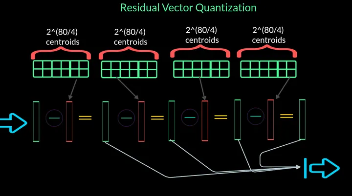
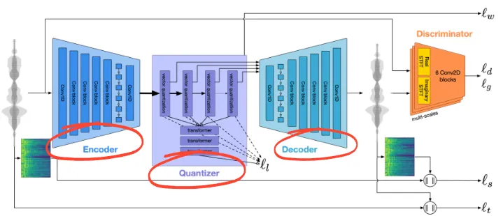
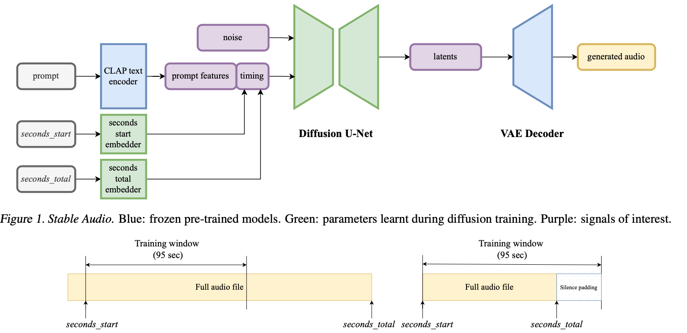
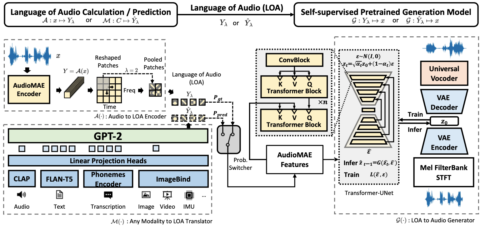

# Установка

**Python 3.11**

```
conda install cuda transformers==4.37.1 pytorch==2.1.0 torchvision==0.16.0 torchaudio==2.1.0 pytorch-cuda=12.1 -c pytorch -c nvidia -y
pip install flash-attn --no-build-isolation
pip install deepfilternet
```

Мог что-то пропустить

# Структура репозитория

[Research.ipynb](Research.ipynb) - ноутбук, где исследовал различные архитектуры и подходы
[scripts/](scripts/) - папка со скриптами. Сейчас там только скрипт по инференсу MusicGen Large и утилиты
[samples/](samples/) - папка с примерами различных песен от разных исследованных архитектур

# Инструкция по запуску кода

```
cd scripts/
python musicgen_large.py "An uplifting jazz song that makes your head shake" --output output.wav --durability_seconds 10
```

# Архитектуры

## MusicGen Large
Подход представляет из себя модифицированный VQVAE, в котором модифицирован процесс квантизации (вместо одного codebook'a делается residual vector quantization, где каждый остаток квантизируется и из него вычитается ближайший embeding из соответствующего codebook'a. Таким образом, выучивается последовательность codebook'ов, по одному для каждого шага, см. рис. ниже). Модель примечательная тем, что обучается на исходных waveform'ах, а не на mel-спектрограммах. Encoder представляет собой обычный каскад 1D-свёрток


Тем не менее, при квантизации используется три лосса - MSE между mel исходным и реконструированным, ошибка реконструкции исходной waveform'ы после квантизации (стандартный лосс VQVAE), и лосс критика (как в Adversarial autoencoder). См. ниже



На втором этапе обучения обучается декодер трансформера (GPT) на квантизованных аудиопредставлениях. Тут ничего примечательного, всё как с обычными LLM

## Stable Audio

Самая современная модель из этих трёх (в статье есть даже сравнения с остальными двумя в пользу этой).

В отличие от предыдущей работы, здесь под капотом latent diffusion (т.е. диффузия на латентном пространстве). Пространство это, в отличие от токенов, непрерывное, а потому здесь используют обычный VAE вместо VQ. Если точнее, то используют The Descript Audio Codec. Кроме этого, авторы утверждают, что вместе со Snake-активацией он работает лучше RVQ из статьи выше. Возможными причинами этому могут служить накопление ошибки на каждом Residual Quantization stage, а также неспособность RVQ отлавливать сложные зависимости в аудиоряде.

На самом латентном пространстве выучивается диффузия. Текстовые CLAP-эмбединги и метаинформация о продолжительности трека подмешиваются в classifier-free guidance диффузии.

Процесс обучения двухэтапный - сначала выучивается VAE (The Descript Audio Codec w. Snake activation), затем на сжатых этим обученным енкодером треках учится диффузия.

На инференсе енкодер не нужен - стартуем с диффузии, генерим latent code по text ccaption'y и декодим до звука.

Архитектура на рис. ниже


## AudioLDM2 Music
Модель на mel-спектрограммах, сочетающая и AE, и VAE, и GPT, и трансформеры, и диффузию. В основе лежит LOA (Language Of Audio), токенами которого являются патчи мел-спектрограммы.

Первым этапом выучивается AudioMAE (см. рис. ниже). Обучается он по принципу Denoising Autoencoder, архитектура декодера и энкодера похожа на ViT (Visual Transformer). Конкретно, берётся мел-спектрограмма аудио в виде картинки, бьётся на патчи, и случайные патчи реконструируются при обучении (как в Masked Language Modeling в BERT'e). Смысл трюка в том, чтобы заставить латентное представление содержать всю необходимую семантику о песне.

На втором этапе выучивается адаптер (GPT-2), который проектирует caption или другую вводную метаинформацию о песне в то же латентное представление.

На третьем этапе выучивается латентная диффузия, но Unet в ней заменён на Transformer-Unet (похоже на DiT - Diffusion Transformer). Её задача восстановить исходное латентное представление песни по латентному представлению, взятому из адаптера.

Наконец, на четвёртом этапе с помощью VAE+Vocoder восстановленное диффузией латентное представление декодится в аудиоряд.


# Примеры аудио
## MusicGen Large

* [80s pop track with bassy drums and synth](samples/MusicGen_Large/80s_pop_track_with_bassy_drums_and_synth.wav)
* [90s rock song with loud guitars and heavy drums](samples/MusicGen_Large/90s_rock_song_with_loud_guitars_and_heavy_drums.wav)
* [Techno music with a strong, upbeat tempo and high melodic riffs](samples/MusicGen_Large/Techno_music_with_a_strong,_upbeat_tempo_and_high_melodic_riffs.wav) 
* [Lo-fi funk](samples/MusicGen_Large/Lo-fi_funk.wav)
* [Country instrumental](samples/MusicGen_Large/Country_instrumental.wav)
* [An uplifting jazz song that makes your head shake](samples/MusicGen_Large/An_uplifting_jazz_song_that_makes_your_head_shake.wav)


## AudioLDM2 Music

* [80s pop track with bassy drums and synth](samples/AudioLDM2_Music/80s_pop_track_with_bassy_drums_and_synth.wav)
* [90s rock song with loud guitars and heavy drums](samples/AudioLDM2_Music/90s_rock_song_with_loud_guitars_and_heavy_drums.wav)
* [Techno music with a strong, upbeat tempo and high melodic riffs](samples/AudioLDM2_Music/Techno_music_with_a_strong,_upbeat_tempo_and_high_melodic_riffs.wav) 
* [Lo-fi funk](samples/AudioLDM2_Music/Lo-fi_funk.wav)
* [Country instrumental](samples/AudioLDM2_Music/Country_instrumental.wav)
* [An uplifting jazz song that makes your head shake](samples/AudioLDM2_Music/An_uplifting_jazz_song_that_makes_your_head_shake.wav)


## Stable Audio

* [80s pop track with bassy drums and synth](samples/Stable_Audio/80s_pop_track_with_bassy_drums_and_synth.wav)
* [90s rock song with loud guitars and heavy drums](samples/Stable_Audio/90s_rock_song_with_loud_guitars_and_heavy_drums.wav)
* [Techno music with a strong, upbeat tempo and high melodic riffs](samples/Stable_Audio/Techno_music_with_a_strong,_upbeat_tempo_and_high_melodic_riffs.wav) 
* [Lo-fi funk](samples/Stable_Audio/Lo-fi_funk.wav)
* [Country instrumental](samples/Stable_Audio/Country_instrumental.wav)
* [An uplifting jazz song that makes your head shake](samples/Stable_Audio/An_uplifting_jazz_song_that_makes_your_head_shake.wav)


# Резюме

* Попробововал 3 современных модели генерёжки музыки - Stable Audio, MusicGen Large (Facebook), AudioLDM2
* Попробовал 3 подхода к денойзингу полученного аудио. Получилось улучшить качество, сделав музыку более приятной слуху и естественной, избавив от шумов
* Написал скрипт инференса
* Расписал, как работают исследованные архитектуры под капотом
* Набросал дальнейший план работ

# План дальнейших улучшений

* Lumina-T2X - инференс не заработал из-за старой видеокарточки. На колабе запустить не успел
* Завести Lumina-Next - это продолжение Lumina-T2X с заменой бэкбона на трансформеры

## MusicGen
* Огромное поле экспериментов с GPT под капотом. Помимо множественных улучшений/ускорений самого GPT, можно ещё и RAG навесить, чтобы генерил не херню, а опираясь и глядя на коллекцию существущих композиций (здесь только надо быть осторожным, чтоб MusicGen не научился плагиатить)
* Попробовать заменить RVQ на The Descript Audio Codec w. Snake activation
* Добавить ещё одного критика на Mel-спектрограммы
* Conv1D енкодер выглядит, мягко говоря, не очень эффективно для анализа длинных аудиорядов. Какой-нибудь Transformer, Mamba или Test Time Trained RNN тут намного лучше бы справились
* Дистилляция. Кажется, что основной bottleneck производительности именно в генерёжке латентной последовательности, а потому можно попробовать ускорить GPT, и тогда будет вообще пушка
  
## Stable Audio
Тяжело тягаться с https://stability.ai/ в креативности, тут в основном надо брать все идеи из Stable Audio 1 и особенно из Stable Audio 2 и аккуратно и последовательно накатывать каждую идею на Stable Audio Open самому. Но первое, что пришло в голову сразу - заменить старый DiT на более современный DiffiT. Автоенкодер тоже можно сделать с более длинной памятью или attention'ом

## AudioLDM2 Music
Уже достаточно старенькая архитектура, не ковырялся бы сильно с ней. Но поле для улучшений здесь огромное, архитектура отдалённо похожа на Stable Audio, и очень много архитектурных идей и решений из Stable Audio легко переедет сюда, и кто знает, какое качество после этого покажет этот старичок. К тому же, много предложенных выше идей вроде более продвинутого енкодера и DiffiT сюда хорошо ложатся. Плюс GPT-2 в наше время - это очень несерьёзно, и его давно бы пора заменить на что-нибудь более свежее, быстрое и качественное. Наконец, можно на выход вокодера накинуть критика - получится что-то аля alpha-GAN и AAE
